<div align="center">

<!-- LOGO — docs/images/logo.png (512×512) goes here
     docs/images/logo.png (512×512) goes here
      -->

# StackVo

**A desktop app that manages Docker-based local development environments.**

Every project gets its own PHP version, its own database, its own domain and its
own HTTPS certificate — without typing `docker compose` or installing a single
PHP on your machine.

[](https://github.com/stackvo/stackvo/actions/workflows/ci.yml)
[](https://github.com/stackvo/stackvo/actions/workflows/nightly.yml)
[](https://github.com/stackvo/stackvo/releases)
[](https://github.com/stackvo/stackvo/releases)
[](LICENSE)

[](#2-installation)
[](https://tauri.app)
[](https://www.rust-lang.org)
[](https://vuejs.org)
[](.nvmrc)
[](#1-requirements)

[](https://github.com/stackvo/stackvo/issues)
[](https://github.com/stackvo/stackvo/pulls)
[](https://github.com/stackvo/stackvo/graphs/contributors)
[](https://github.com/stackvo/stackvo/commits/main)
[](CODE_OF_CONDUCT.md)
[](CONTRIBUTING.md)
[](https://github.com/stackvo/stackvo/stargazers)

[Türkçe](README_TR.md) &nbsp;·&nbsp; **English**

[Quick start](#quick-start-5-minutes) ·
[Features](#why-stackvo) ·
[Examples](#usage-by-example) ·
[CLI](#using-it-from-a-terminal-stackvo) ·
[Architecture](#architecture) ·
[Comparison](#how-it-compares)

</div>

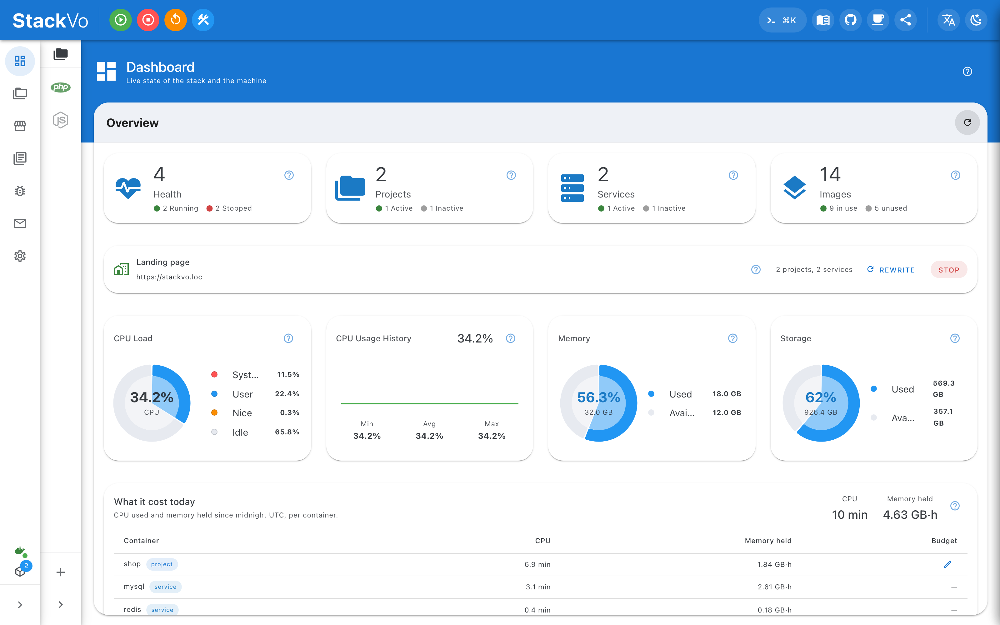

---

## Table of contents

- [What is StackVo?](#what-is-stackvo)
- [Why StackVo?](#why-stackvo)
- [Quick start (5 minutes)](#quick-start-5-minutes)
- [Screenshots](#screenshots)
- [Core concepts](#core-concepts)
- [Usage by example](#usage-by-example)
- [Using it from a terminal (`stackvo`)](#using-it-from-a-terminal-stackvo)
- [Using it from an AI assistant (MCP)](#using-it-from-an-ai-assistant-mcp)
- [Coming from another tool](#coming-from-another-tool)
- [Supported stack](#supported-stack)
- [Architecture](#architecture)
- [Configuration](#configuration)
- [Security and privacy](#security-and-privacy)
- [How it compares](#how-it-compares)
- [Building from source](#building-from-source)
- [Status and roadmap](#status-and-roadmap)
- [FAQ](#faq)
- [Contributing, support and license](#contributing-support-and-license)

---

## What is StackVo?

StackVo is a desktop application that manages the **local development
environment** on your machine. For each project it brings up the web server, the
PHP (or Node, Python, Go, Ruby, Rust) version, the database and any supporting
services as **Docker containers** — you just press a button in a window.

Put simply:

```text
The old way                                   With StackVo
─────────────────────────────────────────     ────────────────────────────────
brew install php@8.1                          New project → pick PHP 8.4
…now the other project needs PHP 8.4          Other project → pick PHP 8.1
MySQL 8.0 installed, project wants 5.7        Each project gets its own MySQL
edit /etc/hosts by hand                       Domain is automatic: shop.loc
click through the certificate warning         HTTPS is automatic and trusted
```

Three sentences:

1. **A project is a container.** Two projects can hold two PHP versions, two
   databases and two sets of environment variables on one machine without
   arguing.
2. **The app runs on your host, not inside a container.** If Docker is down it
   tells you and offers to start it; it can stop the whole stack; it reads real
   host CPU and memory.
3. **One core, three surfaces:** the window, the `stackvo` command line, and an
   MCP server for AI assistants. All three go through the same contract.

> **Who is it for?** Developers juggling several PHP/Laravel/WordPress/Node
> projects at once, who would rather not debug "it works on my machine", and who
> want a team to share one environment definition.

---

## Why StackVo?

| Feature | What it gives you |
|---------|-------------------|
| **Isolated environment per project** | PHP 5.6–8.5, Node, Python, Go, Ruby, Rust — no project breaks another's versions. |
| **Automatic HTTPS and domains** | An address like `shop.loc`, a trusted mkcert certificate, routing through Traefik. No browser warning. |
| **A real desktop app** | Tauri 2 + Rust. ~27 MB installed, CLI included. Not a web UI — it opens even when Docker is down. |
| **30+ ready services** | MySQL, MariaDB, PostgreSQL, MongoDB, Redis, Valkey, RabbitMQ, Kafka, Elasticsearch, MinIO, Grafana, phpMyAdmin… |
| **A full environment per git branch** | Each worktree gets its own hostname **and its own database**. What cloud "preview environments" sell — locally and free. |
| **"Why was this request slow?"** | Profiler, query log and your `dump()` calls on one axis; replay a recorded request with one click. |
| **In-app mail inbox** | Sent mail is captured and read inside the app — no browser tab round trip. |
| **Named database snapshots** | Take one before a migration, restore it by name. Scheduled snapshots too. |
| **A monorepo as one project** | `api/` in Go, `web/` in Next.js, `worker/` in Python — one entry, one start, one certificate. |
| **Public tunnels, 9 providers** | Cloudflare, ngrok, Tailscale, zrok, Pinggy, localtunnel, localhost.run, LocalXpose. |
| **MCP for AI assistants** | 38 tools; writes sit behind an explicit flag, a project scope and a time limit. |
| **Imports from 7 tools** | XAMPP, Laragon, MAMP, Valet, Sail, Herd, DDEV — it brings your projects over. |
| **It measures the cost** | *"`shop` has held 4.2 GB·hours and used 38 minutes of CPU today."* The only tool here that measures what Docker costs you. |
| **Accessible and localised** | English and Turkish UI, RTL support, an EN 301 549-shaped conformance statement backed by tests. |

---

## Quick start (5 minutes)

### 1) Requirements

| Requirement | Detail |
|-------------|--------|
| **Docker** | Docker Desktop on macOS/Windows, Docker Engine on Linux. **Podman, Colima and OrbStack** are recognised too (Podman's rootless socket is looked for first). |
| **OS** | macOS 10.15+, Windows 10+, Linux (x86_64 / aarch64) |
| **Disk** | ~27 MB for the app, plus Docker images (GB) |

> If Docker is not running the app still opens, reports it, and offers to start
> it — the one thing a dashboard living inside a container could never do.

### 2) Installation

Six installers are built per release, two per platform:

| Platform | Formats | Notes |
|----------|---------|-------|
| macOS | `.dmg` | Apple Silicon and Intel |
| Windows | `.msi`, `.exe` (NSIS) | x64 and ARM64 |
| Linux | `.deb`, `.rpm`, `.AppImage` | x86_64 and aarch64 |

> **No release is published yet.** Today the only route is
> [building from source](#building-from-source). This section gets download
> links when the first tag ships.

<details>
<summary><b>Opening a build that is not code-signed</b> (read this if macOS says "damaged")</summary>

Releases are not code-signed, and that is a decision rather than an oversight
(see the [FAQ](#faq)). At first launch your OS will complain:

- **macOS** — "StackVo is damaged and can't be opened" is about the quarantine
  attribute, not about the file. Right-click the app → **Open** → **Open** again.
  Or from a terminal:

  ```sh
  xattr -dr com.apple.quarantine /Applications/StackVo.app
  ```

- **Windows** — SmartScreen shows "Windows protected your PC". Click
  **More info** → **Run anyway**.
- **Linux** — Nothing to do. An AppImage needs `chmod +x`, as every AppImage does.

Every release publishes `SHA256SUMS-<target>.txt` beside its artifacts, and the
app's updater verifies a **minisign** signature over the update manifest.

</details>

### 3) First run

The first launch asks exactly one question: **where should the workspace live?**

```text
~/.stackvo/                 ← the default; change it with STACKVO_ROOT
├── .env                    the stack's settings (services, ports, TLD)
├── generated/              rendered compose/Dockerfiles — safe to delete
├── certs/                  mkcert certificates
└── projects/
    └── shop/
        ├── stackvo.json    the manifest — the only file you edit by hand
        └── Dockerfile      rendered
```

Point it at an empty folder and the app writes everything itself. An existing
StackVo workspace is used as it is and left exactly as it is.

### 4) Your first project

Everything runs from the window. **Projects → New project** opens a wizard:

| Step | What it asks |
|------|--------------|
| 1 | Project name and folder — the domain is derived from the name (`shop` → `shop.loc`) |
| 2 | Framework: Laravel, WordPress, Symfony, plain PHP, Node… |
| 3 | Runtime and version (PHP 8.4, Node 22…), and the web server (nginx, caddy…) |
| 4 | The services you want: MySQL, Redis, Mailpit… |

Press **Create**, and this is what happens behind it:

```text
stackvo.json  ──►  renderer (Rust)  ──►  Dockerfile + compose fragment + Traefik router
                                           │
                                           ├─ the container comes up
                                           ├─ one line into /etc/hosts (diff shown first, one elevated write)
                                           └─ an mkcert certificate  →  https://shop.loc
```

Progress is not a guessed bar: the build **streams Docker's own output**, so you
read the same lines you would in a terminal. When it finishes, click the domain
on the project row — the browser opens, with no certificate warning.

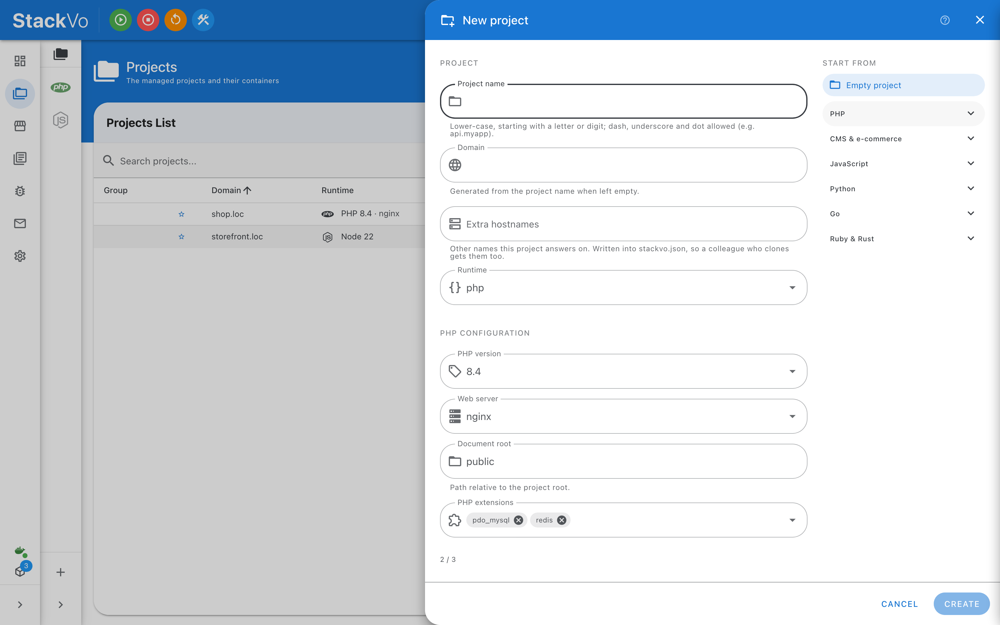

### 5) Everyday use — where things are

The seven pages down the left are the whole application:

| Page | What it is for |
|------|----------------|
| **Dashboard** | The machine: CPU, memory, disk, network, running projects, Docker's health |
| **Projects** | The project list; start / stop / rebuild from the row, open the domain |
| **Catalogue** | Install services and pick versions; run two instances of one service side by side |
| **Logs** | Every project's logs in one place, live |
| **Dumps** | Your application's `dump()` / `dd()` output — without printing it to the browser |
| **Mail** | The mail your app sent; HTML preview, search, link checks |
| **Settings** | Domain, certificates, PHP, diagnostics, backups, AI assistants |

Clicking a project name opens the **project page**: 45 panes, each about one
subject — Overview, Services, Logs, Terminal, Xdebug, Profiler, Why slow,
Snapshots, Worktrees, Share, Production image, Manifest… Every pane carries a
**?** button that explains, in its own words, what it does.

**When something goes wrong:** *Doctor*, under **Settings → Diagnostics**, says
what is broken and how to fix it, line by line — and most findings come with a
button that fixes them.

> If you prefer a terminal, everything above also has a
> [`stackvo` equivalent](#using-it-from-a-terminal-stackvo). It is not needed to
> use the app — the CLI is there for scripts and CI.

---

## Screenshots

<table>
  <tr><td width="25%" valign="top"><a href="docs/screenshots/dashboard.png"></a><br><sub><b>Dashboard</b><br>Health, cost, machine</sub></td><td width="25%" valign="top"><a href="docs/screenshots/projects.png">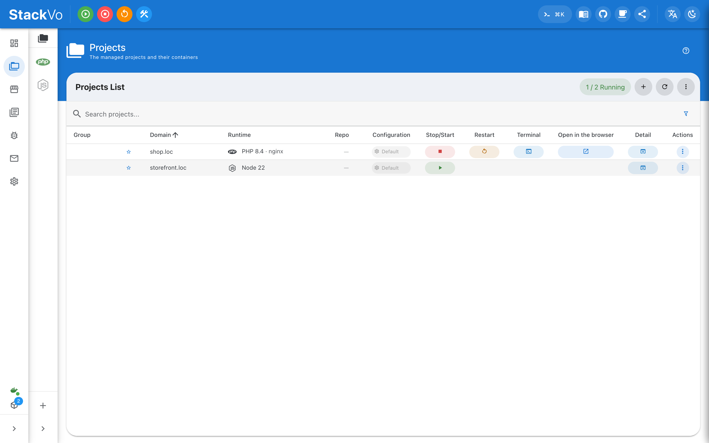</a><br><sub><b>Projects</b><br>Every project and its state</sub></td><td width="25%" valign="top"><a href="docs/screenshots/project-detail.png">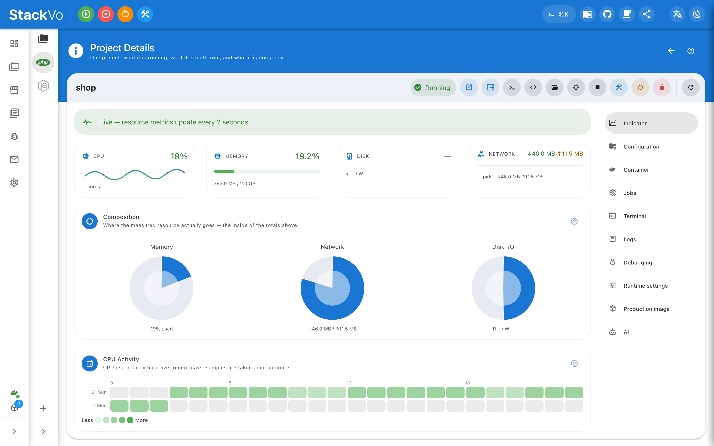</a><br><sub><b>Project detail</b><br>What one project is doing</sub></td><td width="25%" valign="top"><a href="docs/screenshots/project-new.png"></a><br><sub><b>New project</b><br>Name, runtime, PHP</sub></td></tr>
  <tr><td width="25%" valign="top"><a href="docs/screenshots/market.png">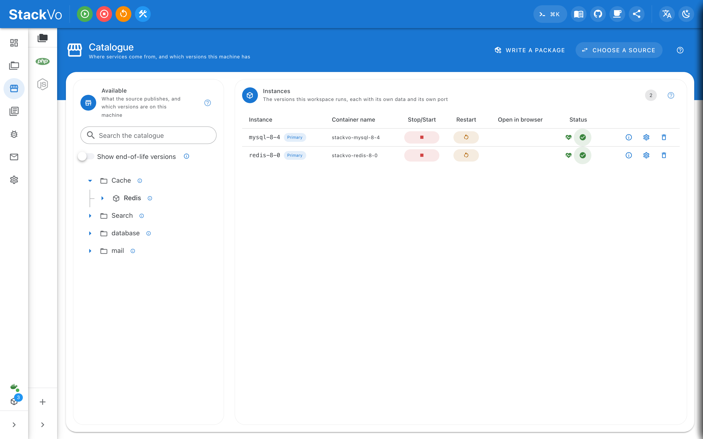</a><br><sub><b>Catalogue</b><br>Packages and versions</sub></td><td width="25%" valign="top"><a href="docs/screenshots/market-service-detail.png">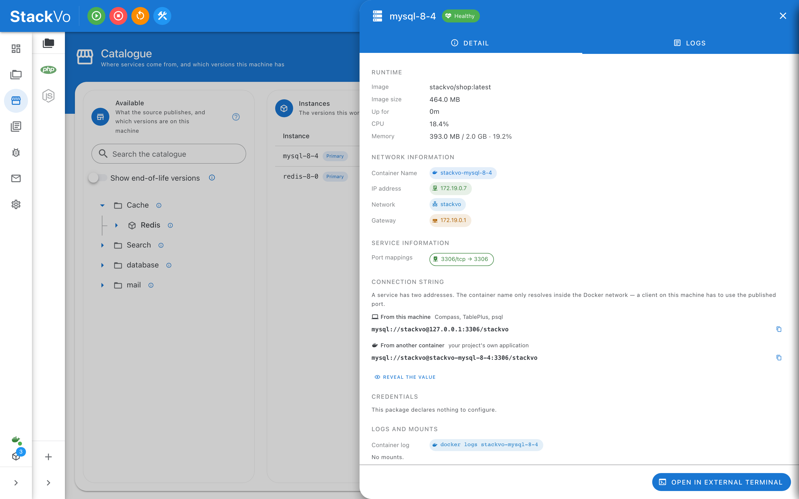</a><br><sub><b>Service detail</b><br>How to reach a service</sub></td><td width="25%" valign="top"><a href="docs/screenshots/project-detail-debugging.png">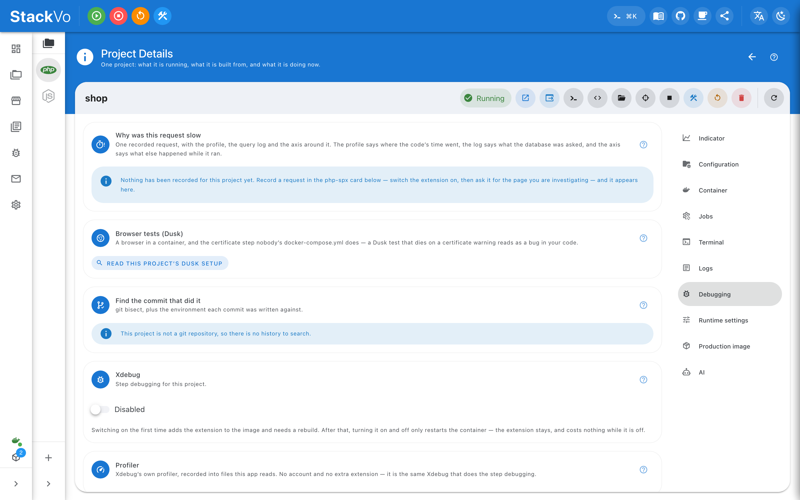</a><br><sub><b>Debugging</b><br>Xdebug, profiler, dumps</sub></td><td width="25%" valign="top"><a href="docs/screenshots/project-detail-terminal.png">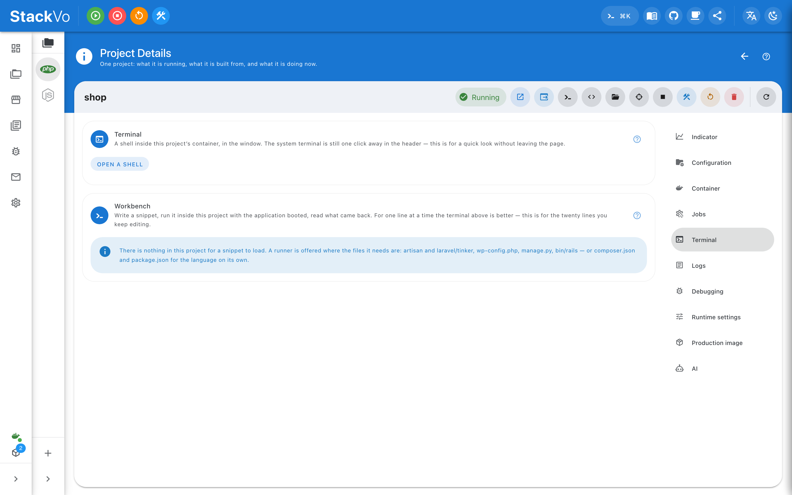</a><br><sub><b>Terminal</b><br>A shell in the container</sub></td></tr>
  <tr><td width="25%" valign="top"><a href="docs/screenshots/mail.png">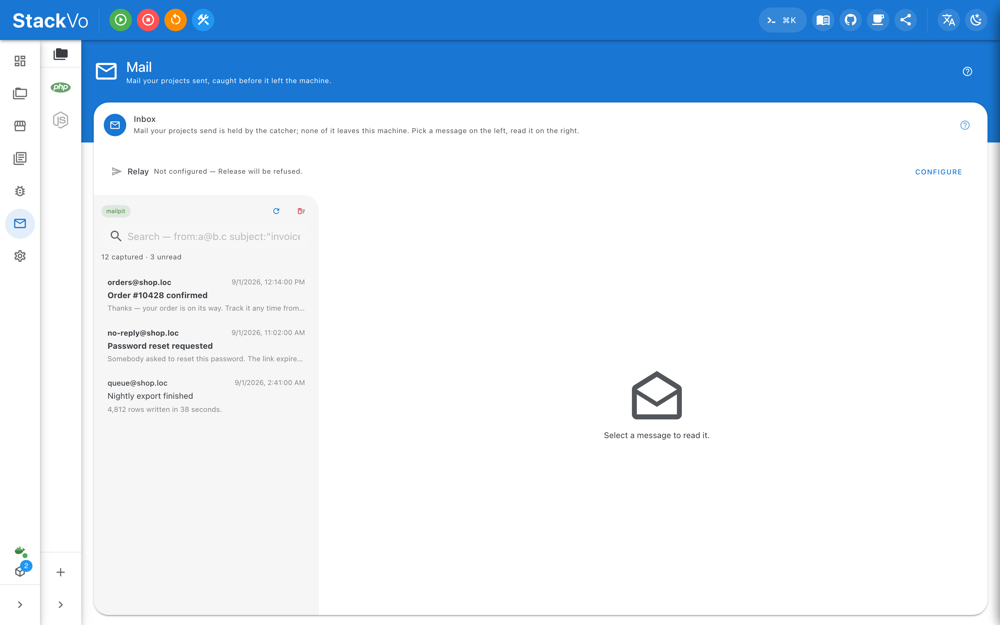</a><br><sub><b>Mail</b><br>What the projects sent</sub></td><td width="25%" valign="top"><a href="docs/screenshots/logs.png">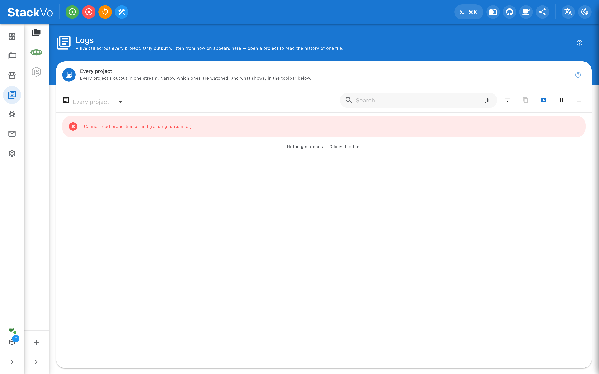</a><br><sub><b>Logs</b><br>Application and server</sub></td><td width="25%" valign="top"><a href="docs/screenshots/settings.png">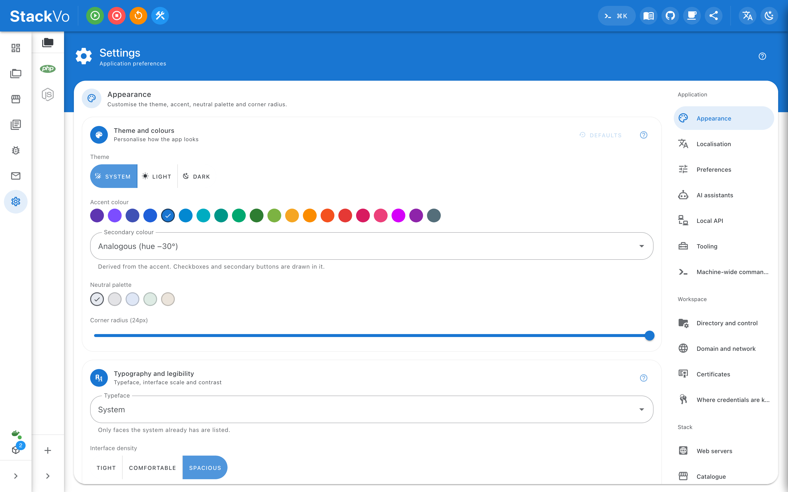</a><br><sub><b>Appearance</b><br>Theme, radius, density</sub></td><td width="25%" valign="top"><a href="docs/screenshots/settings-doctor.png">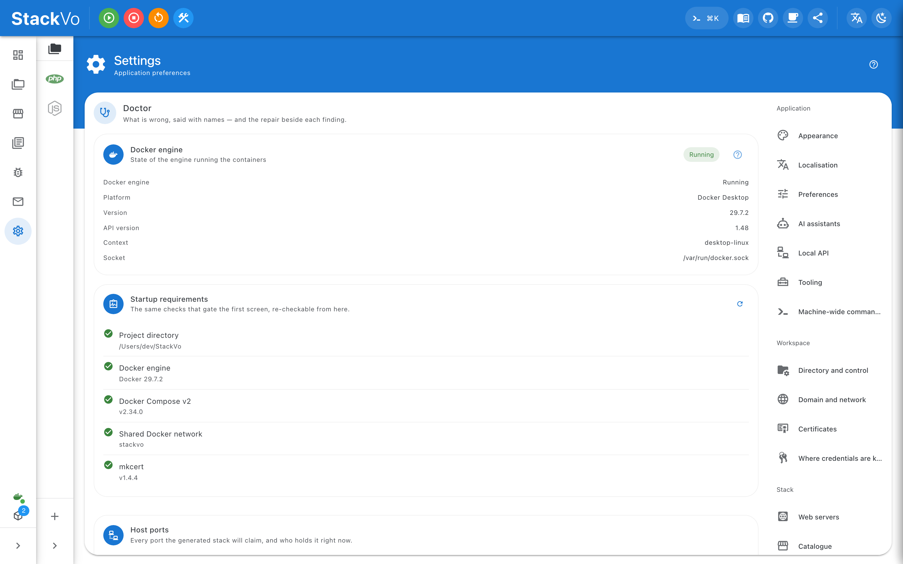</a><br><sub><b>Doctor</b><br>What is wrong, by name</sub></td></tr>
</table>

**[Every screen, in one page →](docs/screenshots/README.md)** — thirty-seven pictures: each
page, the project detail page's ten sections, the settings page's seventeen panes,
and the four sheets that have no address of their own.

They are taken by `npm run screenshots` rather than by hand, at 1600x1000@2x, against
the same boundary the Playwright suite stages — so a UI change reshoots all of them
and none of them is somebody's window at whatever size it happened to be. Two screens
on the original list are still missing and cannot come from this tool: the per-branch
worktree environment, and `stackvo tui`, which is a terminal program rather than a
window in this app.

---

## Core concepts

Understand five things and you understand the whole app.

### 1. The workspace

The one folder the app manages: settings (`.env`), rendered files
(`generated/`) and projects. There is no database — **the directory is the
state**. `generated/` can be deleted at any time and is rebuilt on demand.

### 2. The manifest — `stackvo.json`

The file that describes a project, and **the only one you are meant to edit**.
Commit it, and a teammate gets the same environment.

```json
{
  "name": "shop",
  "framework": "laravel",
  "php": { "version": "8.4", "extensions": ["redis", "intl", "gd"] },
  "server": "nginx",
  "domain": "shop.loc",
  "services": ["mysql", "redis", "mailpit"],
  "commands": {
    "reindex": { "exec": ["php", "artisan", "app:reindex"], "about": "Rebuild the search index" }
  }
}
```

### 3. Generation

Compose files and Dockerfiles are **rendered from the manifest every time**,
never edited in place. So you change the manifest, not the output.
**Settings → Workspace → Generator** reports whether what is on disk still matches
what the renderer would write — which is how a hand-edited generated file is
caught.

The renderer is Rust, and it no longer runs alongside anything: the port reached
byte-for-byte parity on all 28 fixtures against real data, and the Bash engine
was retired in the same change. So there are two behaviours rather than three:

| Mode | Behaviour |
|------|-----------|
| `rust` | Renders and writes. **The default**, and the only writer. |
| `verify` | Renders without writing, and reports drift against what is already on disk. |
| `bash` | Retired. Kept in the enum so an old caller gets a sentence rather than a parse error. |

### 4. Services and packages

MySQL, Redis, Elasticsearch and friends come from a **package catalogue**, which
is signed: `registry.json` with minisign, then a sha256 per manifest, then a
sha256 per file. Two instances of one service — **MySQL 8.0 and 8.4** — can run
side by side.

### 5. Three surfaces, one core

```text
                   ┌──────────────────────────────┐
   Window ─────────►│                              │
   (Vue 3)          │   Rust core                  │──► Docker / Compose
   stackvo CLI ────►│   (130 modules, 348 commands)│──► Traefik · mkcert · hosts
   stackvo-mcp ────►│                              │──► Filesystem (workspace)
   (AI assistant)   └──────────────────────────────┘
```

All three read `contracts/ipc.json`. A CLI command that implements something the
contract does not declare **does not compile** — that is a test, not a habit.

---

## Usage by example

Everything here is done **from the window**. The manifest (`stackvo.json`)
snippets are the second route — "the same thing, from the file" — not a
requirement.

### Changing the PHP version

Pick it from **Project → Overview → PHP version**. The app says the image needs
rebuilding and rebuilds it on one button.

The same change can come from the manifest that lives in your repository; save
the file and the app notices and asks:

```jsonc
// projects/shop/stackvo.json
"php": { "version": "8.1" }   // was 8.4
```

### Turning a service on

The **Catalogue** page lists what can be installed. **Redis → Install**, pick a
version, then tick it on **Project → Services**. The connection string sits in
that same pane; the password appears on a click.

If two projects want two Redis versions, both run: services are installed as
**instances**, not as one global copy.

### Domains and HTTPS

Handled for you on the first project. To look at it directly:

- **Settings → HTTPS certificate** — one wildcard certificate covers the
  dashboard, every service and every project; the reissue button lives here.
- **Settings → Domain** — change the TLD (`.loc`), see the `/etc/hosts` lines.
  Writing hosts is **one elevated call** and shows the diff first.

### Debugging with Xdebug

Flip the switch on **Project → Xdebug**. The pane also gives you the port and
the path mapping your IDE needs (`/var/www/html` ↔ the project folder), and says
whether anything is listening — so "why isn't my breakpoint hit" is answered on
one screen.

### "Why was this request slow?"

On **Project → Why slow**, press **Record**, load the page in your browser, then
stop. Click a request and three sources line up:

- what the sampling profiler saw,
- what the database was actually asked (including the same query asked 40 times),
- your application's own `dump()` calls.

The same pane has a **Replay** button: it re-issues the recorded request with the
profiler on and puts both numbers side by side — the commonest loop in
performance work ("did my change help?") as one click instead of four steps.


### Reading the mail your app sent

The **Mail** page captures it and shows it **inside the app**: HTML preview, link
checks, search. No browser tab needed.

### Database snapshots

**Project → Snapshots** → give it a name → **Take**. Restore is in the same pane
and asks for confirmation. **Settings → Backups** makes it scheduled — measured
from the last snapshot rather than from the clock, so a laptop that was closed
for three days owes one snapshot, not three.

### A full environment per git branch

**Project → Worktrees** → pick the branch → **Create**. The branch gets its own
hostname (`feature-checkout.shop.loc`), **its own database** and its own
environment variables.

The database really is separate: the login granted on it reaches only that
database, so the branch cannot read the one it was branched from. One button in
the same pane removes the whole thing.

Behind the pane it is `worktree.rs` and seven commands, reachable from the CLI
and the MCP server too — this is the thing cloud "preview environments" sell,
locally and free.

### Exposing a project publicly

**Project → Share** — pick a provider and start. Nine are supported: Cloudflare
(anonymous and named), ngrok, Tailscale, zrok, Pinggy, localtunnel,
localhost.run, LocalXpose. Providers that hold a stable address get a password
guard in front of the tunnel.

### A monorepo as one project

**Project → The rest of this repository** adds the repo's other directories as
components with their own runtimes. In the manifest:

```json
{
  "name": "platform",
  "components": [
    { "name": "api",    "path": "api",    "runtime": "go",     "port": 8080 },
    { "name": "web",    "path": "web",    "runtime": "nodejs", "port": 3000 },
    { "name": "worker", "path": "worker", "runtime": "python" }
  ]
}
```

One entry, one start, one certificate. Each component gets its own Dockerfile,
compose service and Traefik router — and none of them can open a host port.

### Handing the stack to a teammate

`.env` is never committed (it holds every password), so whoever clones the repo
gets a perfect manifest and still has to be told "turn on MySQL 8.4 and Redis".
That sentence has a home in the repository — `stackvo.preset.json`:

```json
{
  "services": { "mysql": { "enabled": true, "version": "8.4" },
                "redis": { "enabled": true, "version": "7.2" } },
  "settings": { "DEFAULT_TLD_SUFFIX": "loc" }
}
```

Open the project and the **Requirements** card says a preset is there and **shows
the plan first** — a file that arrived with someone else's clone must not rewrite
your stack because you opened a page. A preset can never carry a secret; the
schema has nowhere to put one.

### Defining your own commands

A project's own command lives in the manifest and appears as a button on
**Project → Commands**:

```json
"commands": {
  "reindex": { "exec": ["php", "artisan", "app:reindex"], "about": "Rebuild the search index" }
}
```

For the commands you run in *every* project there is **Settings → Machine
commands** — the same schema, in one `commands.json` at the root of your
workspace. If a project declares the same id, **the project wins**, and the pane
says which file each row came from. Commands run **in the project's container and
nowhere else**; there is no `host` form.

### Building the production image from here

**Project → Production image** shows the plan, builds the image, saves it and
pushes it to a registry. Your local dev environment also builds the image you
ship.

It is `release.rs` and seven IPC commands — plan, build, save, load, recipe,
push-plan, push — so the same steps are available from the CLI and to an
assistant, not only from this pane.

### Devcontainer export

**Project → Devcontainer → Export** writes a `.devcontainer` for teammates who
prefer working *inside* the container — so a project set up here opens in a cloud
environment too.

---

## Using it from a terminal (`stackvo`)

> **This section is optional.** Everything above is done from the window; the CLI
> is a second face on the same core, and it earns its place in specific spots:
> scripts, CI steps, running one command in the project you have `cd`-ed into, and
> answering a question without opening a window.

`stackvo` and `stackvo-mcp` **ship inside the app**; there is nothing extra to
download. **Settings → Tooling** does the same job with buttons.

```bash
stackvo path-install      # links them into the app's own directory and onto PATH
stackvo tools             # where everything is, and its state
stackvo path-remove       # takes the line back out (a backup was made first)
```

### Everyday commands

```bash
stackvo status                        # projects and services
stackvo up shop / down shop           # start / stop
stackvo restart shop
stackvo logs shop --follow            # live logs
stackvo open shop                     # open in a browser
stackvo doctor --json | jq '.ports[] | select(.state != "ok")'
stackvo tui                           # full-screen terminal UI
```

### Running things in the project's container

`cd` into a project and type:

```bash
stackvo php -v            # the project's PHP, on a host that has none
stackvo artisan migrate --force
stackvo composer install
stackvo npm run build
stackvo wp plugin list    # also console, rails, bundle, yarn, pnpm
stackvo python -V         # and ruby, go, cargo, bun, deno
stackvo shell             # an interactive shell in the container
stackvo exec <program>    # anything else
```

Everything after the command name is passed on **untouched** and the exit code
is passed **through** — which is what makes `stackvo artisan test` meaningful in
a CI script.

### The contract scripts can rely on

| Rule | Detail |
|------|--------|
| `--json` | On **every** command. The table you see is rendered *from* that value, so the two cannot drift. |
| stdout / stderr | The answer is on stdout, the narration on stderr. A failure leaves stdout empty. |
| Exit codes | `3` = nothing set up on this machine · `4` = Docker not running · `2` = bad command line · `1` = everything else · `127` = a runtime this project does not have |
| Unknown flags | An **error** — never silently ignored. |
| Completion | bash, zsh, fish, PowerShell. The command list lives in one place, so a new command is completable the moment it exists. |

---

## Using it from an AI assistant (MCP)

`stackvo-mcp` is an MCP server over the same core the window drives. An assistant
can answer *"why is shop.loc not loading?"* from the preflight report, the hosts
file, the certificate's SAN list and the container's last hundred log lines —
with no window open.

**Settings → AI assistants** lists the eight clients on this machine and
registers the server in one click:

Claude Code · Claude Desktop · Cursor · Windsurf · VS Code · Gemini CLI ·
Codex · Zed

Each client's own config file is read, a **single `stackvo` entry** is inserted,
and the file is written back — every other server in it survives, and a
`.stackvo-backup` copy is kept first.

### Granting access — read-only by default

You grant it with the switches on **Settings → AI assistants**, and the pane
writes back the sentence your choice amounts to — *"this assistant may restart
`shop`, for the next half hour"*.

| Setting | Effect |
|---------|--------|
| *(default)* | Reads only. 26 of the 38 tools are visible. |
| **Allow writes** | Adds the 12 mutating tools — `stack_down` among them, so it can stop the whole stack. |
| **Bound to a project** | The server is bound to one project; the eight tools no project can bound are **not offered at all**. |
| **Time limit** | The writing half ends by itself after the time you set. |
| **Tool by tool** | When even those four are more than the job needs, only the tools you name are opened. |

**Read that list before passing the flag.** 12 of the 38 tools change things and
appear only with **Allow writes**: `xdebug_set`, `certificates_reissue`,
`project_start`, `project_stop`, `stack_up`, `stack_down`, `generate`,
`project_restart`, `service_start`, `service_stop`, `service_restart`,
`snapshot_take`. That grants an assistant the ability to **stop the whole stack**
and to stop a shared service every project depends on, not just to toggle
Xdebug. Every tool is annotated `readOnlyHint` / `destructiveHint`, so a client
can require confirmation for one it has never seen.

**Or bounded, tool by tool and project by project.** The switches have a CLI
spelling: `--project=shop` bounds the server to one project and `--for=30m` ends
the writing half by itself. Under a project scope the twelve writing tools become
the four a project can bound — `xdebug_set`, `project_start`, `project_stop`,
`project_restart` — while the eight that no project bounds, `stack_down` among
them, are not offered at all. A scope that still served `stack_down` would be
reporting a limit it was not applying, which is worse than having no limit. It
bounds the reads the same way: no tool that *names* a project answers for one
outside the scope. It is not information isolation and is not described as one —
the machine-wide instruments still answer, because they are about the machine
rather than about a project.

**Not exposed:** the rest of the mutating surface. 69 of the 344 commands take
an `AppHandle` because they report progress through Tauri's event system, and a
stdio subprocess has no app to emit into. Decoupling that is a refactor of its
own; pretending otherwise would mean advertising `project_build` and having it
fail when called.

The limits:

- **No tool returns a password**, and a test asserts no schema on this surface has
  a `reveal`, `password`, `secret` or `token` property.
- **Restoring a snapshot is deliberately not a tool.** Taking one is — it adds a
  file and changes nothing. Writing data over live rows belongs to the app's own
  confirmation.
- Every writing call — **refusals included** — is written to the audit trail, most
  of them carrying what would put the act back, so it can be reversed from
  Settings in one click.

### Telling the assistant *when* to use it

**Settings → AI rules** writes that into the instruction file the assistant
already reads:

| File | Read by |
|------|---------|
| `CLAUDE.md` | Claude Code |
| `AGENTS.md` | Codex, Zed |
| `.cursor/rules/stackvo.mdc` | Cursor |
| `.github/instructions/stackvo.instructions.md` | VS Code, Copilot |
| `.windsurf/rules/stackvo.md` | Windsurf |
| `GEMINI.md` | Gemini CLI |

Only the region between `<!-- stackvo:rules:begin -->` and
`<!-- stackvo:rules:end -->` is ever written; the rest of the file comes back
byte for byte.

---

## Coming from another tool

StackVo imports from **seven** other local environments — the widest list in
this category:

| Source | Found in | Source | Found in |
|--------|----------|--------|----------|
| **XAMPP** | `htdocs` | **Laravel Sail** | `docker-compose.yml` |
| **Laragon** | `www` | **Laravel Herd** | the site list |
| **MAMP** | `htdocs` | **DDEV** | `.ddev/config.yaml` |
| **Laravel Valet** | parked/linked sites | | |

How it works:

1. It finds what is installed on this machine and **shows you what it found**.
2. It **copies** by default, and moves only if you ask.
3. It **never writes a byte into the installation it is importing from** — no
   PATH edits, no disabled services. Nothing to undo if you change your mind.

---

## Supported stack

### Languages and versions

| Language | Versions | Default |
|----------|----------|---------|
| **PHP** | 5.6 · 7.0–7.4 · 8.0–8.5 | 8.4 |
| **Node.js** | 16 · 18 · 20 · 21 · 22 · 23 | 22 |
| **Python** | 2.7 · 3.5–3.14 | 3.14 |
| **Go** | 1.11–1.23 | 1.23 |
| **Ruby** | 2.4–3.3 | 3.3 |
| **Rust** | 1.70–1.84 | 1.84 |

### Web servers

`nginx` · `apache` · `caddy` · `frankenphp` · **`swoole`** · **`roadrunner`**

The last two are Laravel Octane's two drivers; both *are* the HTTP server, so
Traefik points at 8000 rather than 80.

### Services

| Category | Services |
|----------|----------|
| **Databases** | MySQL · MariaDB · PostgreSQL · MongoDB · Cassandra · ClickHouse · MS SQL Server |
| **Cache** | Redis · Memcached · Valkey · Dragonfly |
| **Queue / messaging** | RabbitMQ · Kafka · Soketi · Beanstalkd |
| **Search** | Elasticsearch · Kibana · Meilisearch · Typesense · Solr |
| **Storage** | MinIO |
| **Monitoring** | Grafana · Prometheus · Graylog |
| **Dev tools** | MailHog · Mailpit · Blackfire |
| **Admin UIs** | phpMyAdmin · Adminer · pgAdmin · Kafbat · mongo-express · phpCacheAdmin |

### PHP extensions

More than 80 extensions are known (`apcu`, `imagick`, `intl`, `redis`, `swoole`,
`mongodb`, `xdebug`, `sqlsrv`…). The default set is one that has been **verified
to build** on the PHP version you picked.

---

## Architecture

### The big picture

```text
┌─────────────────────────────────────────────────────────────────────┐
│  StackVo Desktop  (a normal user process on the host)               │
│                                                                     │
│  ┌───────────────┐   contracts/ipc.json    ┌────────────────────┐   │
│  │  Front end    │  348 commands/75 events │  Back end (Rust)   │   │
│  │  Vue 3        │◄───────────────────────►│  130 modules       │   │
│  │  Vuetify 3    │      Tauri IPC          │  ~76k lines        │   │
│  │  Pinia        │                         │                    │   │
│  │  ~38k lines   │                         │                    │   │
│  └───────────────┘                         └─────────┬──────────┘   │
└──────────────────────────────────────────────────────┼──────────────┘
                                                       │ bollard / compose
                          ┌────────────────────────────▼───────────────┐
                          │  Docker · Podman · Colima · OrbStack        │
                          │  ┌────────┐ ┌──────────┐ ┌───────────────┐  │
                          │  │Traefik │ │ shop     │ │ mysql · redis │  │
                          │  │(proxy) │ │ (project)│ │ (services)    │  │
                          │  └────────┘ └──────────┘ └───────────────┘  │
                          └────────────────────────────────────────────┘
```

### The one flow worth knowing

A user clicks *Create project*:

```text
Vue component
  └─ composable (src/composables/useX.js)        state, no markup
       └─ api.projectCreate(spec)                src/lib/ipc.js
            └─ invoke('project_create', {...})   Tauri IPC
                 └─ #[tauri::command] project_create      src-tauri/src/commands.rs
                      ├─ state.root()                     the workspace, or an error
                      ├─ manifest::parse / validate       a schema, not free-form JSON
                      ├─ scaffold::write(...)             the project's files
                      ├─ generator::render(...)           compose + Dockerfile + proxy
                      └─ runner::run_operation(...)       docker compose, streamed
                           └─ events: project:creating → project:created
```

### Back-end bands

Dependency arrows only ever point **downward**:

```text
  entry        2.0k   lib.rs, main.rs, menu, tray
      ▼
  commands.rs 14.9k   the IPC surface: 348 commands — validation, orchestration
      ▼
  domain      89.7k   107 modules: generator, manifest, certs, hosts, mail,
      ▼               xdebug, profile, worktree, policy, audit… (no Tauri types)
  platform     6.6k   engine (Docker), runner, elevate, pty, watcher, git
      ▼
  primitives   2.3k   error, events, progress, inflight, logging, contracts
```

`commands.rs` is the **only** file that mentions `AppHandle`. Everything below it
can be called from a test, from the `diagnose` example, or from the MCP surface,
with no running application.

### Front-end shape

```text
src/
  views/          9 pages, one per route
  components/     shared widgets + project/ (45 panes) and settings/ (23 panes)
  composables/    18 files: state and boundary calls, no markup
  stores/         Pinia: app, appearance, inventory, metrics, operations
  lib/            ipc.js (the generated client), format, events
  i18n/           en.js, tr.js
```

The rule: **a view composes panes, a pane owns markup, a composable owns state,
and only the composable talks to `api`.**

### Why a desktop app rather than a container

| | A dashboard inside a container | StackVo Desktop |
|--|-------------------------------|-----------------|
| Runs as | container, root, `chmod 666 docker.sock` | host process, the invoking user |
| Docker down | unreachable | opens, reports, offers to start it |
| Host metrics | `/proc` inside a container (wrong) | `sysinfo` on the host |
| Stopping the stack | impossible (kills the UI) | `compose_down` |
| hosts file | manual `sudo tee -a /etc/hosts` | reviewed diff, one elevated write |
| Windows | WSL2 only | native — no shell, no bash |
| Install size | ~600 MB of images | ~27 MB, CLI included |

### Tech stack

| Layer | Technology |
|-------|-----------|
| Shell | Tauri 2 (WebView, Rust) |
| Back end | Rust — `bollard` (Docker API), `serde`, `tokio` |
| Front end | Vue 3 (`<script setup>`), Vuetify 3, Pinia, Vue Router, vue-i18n |
| Terminal | xterm.js over a real PTY |
| Proxy / TLS | Traefik + mkcert |
| Tests | Vitest, Playwright, axe-core, `cargo test`, differential fixtures |
| Package verification | minisign + sha256 |

The full map: **[ARCHITECTURE.md](ARCHITECTURE.md)**

---

## Configuration

### Where things are kept

| | macOS | Windows | Linux |
|--|-------|---------|-------|
| App log | `~/Library/Logs/StackVo/` | `%LOCALAPPDATA%\StackVo\logs\` | `~/.local/state/stackvo/logs/` |
| Preferences | `~/Library/Application Support/StackVo/` | `%APPDATA%\StackVo\` | `~/.config/stackvo/` |
| Stack state | `~/.stackvo/` | `~/.stackvo/` | `~/.stackvo/` |

`~/.stackvo` is yours to move and safe to delete; nothing the app needs **in
order to start** is kept there.

### Environment variables

| Variable | What it does |
|----------|--------------|
| `STACKVO_ROOT` | Moves the workspace |
| `STACKVO_LOG` | Log level — e.g. `stackvo_desktop=debug` |
| `STACKVO_POLICY_FILE` | Points at a different policy file, so you can test one without root |
| `DOCKER_HOST` | As usual; the scheme is stripped where needed |

### Keeping credentials out of `.env`

**Settings → Where credentials are kept** moves a password, token or server id
into the machine's keystore (Keychain / Credential Manager / Secret Service) and
leaves a reference behind:

```sh
SERVICE_MYSQL_ROOT_PASSWORD=keychain:SERVICE_MYSQL_ROOT_PASSWORD@a1b2c3d4
```

That takes it out of the file that gets backed up, synced and pasted into support
threads. **It does not take it off the disk** — the real value is still rendered
into the generated compose file, because that is where Compose reads it from.
That limit is documented rather than glossed over.

### Rolling it out to more than one machine

| | Path |
|--|------|
| macOS | `/Library/Managed Preferences/com.stackvo.desktop.json` |
| Windows | `%ProgramData%\StackVo\policy.json` |
| Linux | `/etc/stackvo/policy.json` |

```json
{
  "schemaVersion": 1,
  "settings": { "DEFAULT_TLD_SUFFIX": "corp.test", "SERVER_TYPE": "nginx" },
  "locked": ["DEFAULT_TLD_SUFFIX"],
  "registryPrefix": "registry.corp.example/proxy"
}
```

- `settings` overrides both the shipped default and the workspace's `.env`.
- `locked` refuses writes to those keys from Settings.
- `registryPrefix` is prepended to every generated image reference (except one
  that already names a registry).
- **This is not a security boundary**, and the app says so: it tells a
  co-operating application what your organisation intends, nothing more.

**Settings → Compliance** measures whether any of the policy is actually holding
on this machine, rather than repeating what the file says.

---

## Security and privacy

- **No telemetry.** That sentence is held up by a test, not by a promise
  (`src-tauri/tests/privacy_claims.rs`).
- **Logs are masked.** Password and token values are masked as the log is
  written; the diagnostic bundle masks a second time and contains no `.env` and
  no project sources.
- **The package chain is verified.** The index is signed with minisign, then a
  sha256 per manifest and per file. A signature that is there is **checked**, and
  a failed check is a refusal — never a quiet fall-through to "unsigned, then".
- **A scan for credentials nobody moved.** It matches the *value*, not the key's
  name (`AKIA…`, `ghp_…`, a PEM header) across `.env` and every file git tracks.
  Findings carry a fingerprint and a masked preview, never the value.
- **Which containers can leave the machine** is asked of Docker rather than
  inferred: a network created `internal` has no gateway, so a container whose
  every network is internal provably cannot route out.
- **An audit trail** records acts that cannot be undone, and every writing call
  an assistant makes — refusals included.

More: [SECURITY.md](SECURITY.md) · [PRIVACY.md](PRIVACY.md)

---

## How it compares

This table is about **what each tool chose**, not about better or worse.

| | **StackVo** | Herd | ServBay | Laragon | DDEV | Laradock | Devilbox | FlyEnv |
|---|---|---|---|---|---|---|---|---|
| Approach | Docker + desktop | Native binaries | Native binaries | Native binaries | Docker + CLI | Docker + compose | Docker + compose | Native binaries |
| Interface | Desktop + CLI + TUI + MCP | Desktop | Desktop | Desktop | CLI | none | Web intranet | Desktop |
| Platforms | mac · Win · Linux | mac · Win | mac · Win | Win | mac · Win · Linux | all | all | mac · Win · Linux |
| Project isolation | Container | Site | Site | Site | Container | Shared stack | Shared stack | Site |
| Automatic HTTPS | Yes (mkcert) | Yes | Yes | Yes | Yes | manual | Yes | Yes |
| Per-branch env + **own DB** | Yes | No | No | No | partial | No | No | No |
| Request-level "why slow" | Yes (profile+queries+dumps) | partial (Pro) | No | No | No | No | No | No |
| Replay a recorded request | Yes | No | No | No | No | No | No | No |
| In-app mail inbox | Yes | Yes (Pro) | Yes (Pro) | Yes | web UI | web UI | web UI | Yes |
| Named DB snapshots | Yes (+ scheduled) | No | scheduled | scheduled | Yes | No | No | No |
| Monorepo as one project | Yes | No | No | No | No | No | No | No |
| MCP / AI integration | Yes — 38 tools, scoped | No | Yes | No | No | No | No | Yes |
| Builds the production image | Yes | No | No | No | No | Yes | No | No |
| Devcontainer export | Yes | No | No | No | No | No | No | No |
| Import sources | **7** | 1 | a few | No | a few | No | No | a few |
| Measures resource cost | Yes | No | No | No | No | No | No | No |
| Admin policy (MDM) | Yes | No | team plan | No | No | No | No | No |
| Portable install | No (by architecture) | No | No | Yes | No | No | No | Yes |
| Runs in Codespaces/Gitpod | No | No | No | No | Yes | Yes | Yes | No |
| Price | Free, MIT | Free + Pro $99/yr | Free + Pro | Free | Free, Apache-2 | Free, MIT | Free, MIT | Free |

<sub>Compiled from each project's own documentation, August 2026. If a row is
wrong, please open an issue and it will be corrected.</sub>

### Being honest: what Docker costs you

| | StackVo | A tool that installs PHP on the host |
|---|---|---|
| First install | the app (~27 MB) **plus** Docker and its images (GB) | one installer, ~100 MB |
| A project's first `up` | an image build — minutes | seconds |
| **Changing PHP version** | rewrite the manifest, rebuild the image | immediate |
| Idle memory | the Docker VM, Traefik and whatever services are on | the language runtime alone |

What you get for it is the thing none of them can offer: every project's
environment is a container, so what runs on your machine is what a Dockerfile
says rather than what your `brew` history says.

**Two limits, both decided rather than missing:**

- **There is no portable install, and there cannot be one.** Images and volumes
  live in Docker's own store. `STACKVO_ROOT` is half an answer — your workspace
  moves with you, the engine does not.
- **It does not run inside Codespaces or Gitpod.** This is a desktop
  application. What it does instead is **export a devcontainer**, so a project
  set up here can be opened in a cloud environment.

---

## Building from source

### Requirements

- Node.js **22+** (an `.nvmrc` is provided)
- Rust (stable; the version is pinned in `src-tauri/rust-toolchain.toml`)
- Tauri 2 system dependencies — [tauri.app/start/prerequisites](https://tauri.app/start/prerequisites/)
- Docker, to run the app

### Build and run

```bash
git clone https://github.com/stackvo/stackvo.git
cd stackvo
npm install
npm run tauri:dev          # run the app in development

npm run tauri:build        # produce the installers
```

### Tests and checks

```bash
npm test                   # vitest + Rust unit, integration and differential tests
npm run test:js            # front end only
npm run test:e2e           # Playwright, accessibility included
npm run lint               # eslint + prettier
npm run audit              # cargo-deny + npm audit
npm run contracts:check    # IPC contract agreement
npm run diagnose           # headless end-to-end check
npm run bundle:budget      # asset size budget
```

CI runs all of it on **Linux, macOS and Windows**, with `cargo clippy -D
warnings` and `cargo fmt --check`.

### House rules worth knowing

- **The contract comes first.** A command absent from `contracts/ipc.json` can
  be neither registered in `lib.rs` nor driven from the CLI; tests enforce it.
- **Generated files are never hand-edited.** `generated/` must always be
  reproducible, and `generator_verify` proves it on a real machine.
- **A pane's markup and its styles move together.** `<style scoped>` reaches only
  its own component; `tests/pane-styles.spec.js` checks it.

More: [CONTRIBUTING.md](CONTRIBUTING.md)

---

## Status and roadmap

| Phase | Scope | Status |
|-------|-------|--------|
| 0 | Freeze the config contract, extract the extension matrix, derive the IPC surface | Done |
| 1 | Tauri + Vue skeleton; read-only views on real metrics | Done |
| 2 | Container control via `bollard`; streamed build/log progress | Done |
| 3 | Tray, notifications, fs-watcher, hosts helper, PTY, autostart | Done |
| 4 | Generator port to Rust, native Windows, signed auto-updates | In progress |
| 5 | Release plumbing (signing key pair, update endpoint) | In progress |

**What no commit can close** is named out loud: publishing the update endpoint,
generating the signing key pair, and buying the Apple and Windows certificates.
Those are decisions and purchases rather than work — `npm run updates:check`
reports a missing endpoint, and a release run warns on every unsigned target.

---

## FAQ

<details>
<summary><b>Is Docker required?</b></summary>

Yes. Docker Desktop, Docker Engine, or an API-compatible runtime (Podman,
Colima, OrbStack). The engine's name is only a label — nothing branches on which
of them answered.
</details>

<details>
<summary><b>Why isn't it code-signed?</b></summary>

The app is distributed from GitHub Releases and nowhere else. An Apple Developer
membership and an Authenticode certificate are recurring costs with an identity
attached, and skipping them was the last external dependency dropped from the
chain. In exchange: every release publishes `SHA256SUMS`, and the updater
verifies a minisign signature.
</details>

<details>
<summary><b>What happens to my existing StackVo (Bash/web UI) setup?</b></summary>

It keeps working. Both tools read the same `stackvo.json` and `.env`, so a
project created in either works in the other. That compatibility is enforced by
a checked-in contract and a validator, not by convention.
</details>

<details>
<summary><b>Can I run two versions of the same service at once?</b></summary>

Yes. Services are installed as instances; MySQL 8.0 and 8.4 can run side by
side, and each project connects to the one it asked for.
</details>

<details>
<summary><b>What's the state of Windows support?</b></summary>

The pure logic — drive-letter to bind-mount conversion, named-pipe detection,
`DOCKER_HOST` scheme stripping — is written without `cfg` gates, so its tests run
on **every** platform, and `windows-latest` is in the CI matrix. What a compiler
cannot answer is still unverified: the hosts-file write through UAC, the named
pipe against a real Docker Desktop, and whether a project's domain resolves in a
browser there. Until this line says otherwise, nobody has checked.
</details>

<details>
<summary><b>Where does my data go?</b></summary>

Nowhere. No telemetry, no reporting. The only network calls are ones **you
press**: refreshing the package catalogue, checking for updates, and asking a
public database whether your dependencies have advisories. That last one is a
separate button because it sends package names off the machine, and the sentence
saying so sits above it. Full detail: [PRIVACY.md](PRIVACY.md)
</details>

<details>
<summary><b>Can I use it on a server or in CI?</b></summary>

It is not a design goal. The CLI and the loopback HTTP surface make headless use
technically possible, but it has not been tested end to end, so it is not called
supported.
</details>

---

## Contributing, support and license

| Document | What's in it |
|----------|--------------|
| [CONTRIBUTING.md](CONTRIBUTING.md) | How to build it and what the checks want |
| [ARCHITECTURE.md](ARCHITECTURE.md) | The map of the code |
| [SUPPORT.md](SUPPORT.md) | Where a question goes, what to attach to a bug report |
| [SECURITY.md](SECURITY.md) | Report privately, never as a public issue |
| [ACCESSIBILITY.md](ACCESSIBILITY.md) | The conformance statement, EN 301 549-shaped |
| [PRIVACY.md](PRIVACY.md) | What is stored, and every host it can reach |
| [CODE_OF_CONDUCT.md](CODE_OF_CONDUCT.md) | Be decent to people; argue with the work as hard as it deserves |
| [CHANGELOG.md](CHANGELOG.md) | Every change, with the reasoning behind it |
| [README_TR.md](README_TR.md) | Bu belgenin Türkçesi — the same document in Turkish |
| [docs/README-legacy.md](docs/README-legacy.md) | The previous long-form README, kept for its design notes |

**License:** [MIT](LICENSE) © 2026 Fahrettin Aksoy

<div align="center">

**[Back to top](#stackvo)** &nbsp;·&nbsp; [Bu belgeyi Türkçe okuyun](README_TR.md)

</div>
