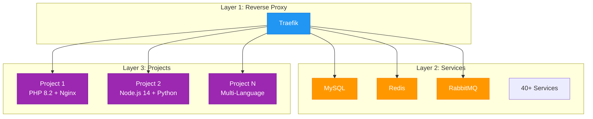

# Introduction to Stackvo

Stackvo is a Docker-based development environment management system that accelerates and simplifies your modern web development processes. This page explains in detail what Stackvo is, what problems it solves, its key features, and why it is better than other alternatives.

---

## What is Stackvo?

**Stackvo** is a **Docker-based**, fully **customizable**, and **modular** development environment management system for your modern web development projects.

!!! quote "Full Stack with One Command"
Stackvo allows you to start, manage, and scale 40+ services with a single command.

---

## Key Features

### Multi-Language Support

Stackvo supports 6 different programming languages:

| Language | Version Support | Features |
|-----|------------------|------------|
| **PHP** | 5.6 - 8.5 | 70+ extensions, Composer, Xdebug |
| **Node.js** | 12+ | npm, yarn, PM2, TypeScript |
| **Python** | 2.7 - 3.14 | pip, virtualenv, Django, Flask |
| **Go** | 1.11+ | Modern Go toolchain |
| **Ruby** | 2.4 - 3.3 | Bundler, Rails ready |
| **Rust** | 1.56+ | Cargo package manager |

### 40+ Ready-to-Use Services

| Category | Count | Examples |
|----------|------|----------|
| **Database** | 8 | MySQL, PostgreSQL, MongoDB, MariaDB |
| **Cache** | 2 | Redis, Memcached |
| **Message Queue** | 4 | RabbitMQ, Kafka |
| **Search** | 4 | Elasticsearch |
| **Monitoring** | 5 | Grafana |
| **Web Server** | 4 | Nginx, Apache, Caddy |
| **Other** | 13+ | Adminer, phpMyAdmin, phpPgAdmin |

!!! info "All Services"
    Check the [Services](../references/services.md) page for a detailed list of services.

---

## Why Stackvo?

=== "Traditional Method"

    **❌ Problems:**

    - Separate installation for each service
    - Version conflicts
    - Port conflicts
    - Complex configuration
    - Platform dependence
    - Inconsistencies within the team

=== "With Stackvo"

    **✅ Solutions:**

    - Entire stack with one command
    - Isolated environments
    - Automatic port management
    - Configuration in a single file (.env)
    - Platform independent
    - Consistency within the team

---

## Key Concepts

### Generator System

!!! info "Pure Bash Implementation"
    Stackvo's generator system is written entirely in **Bash**.

It automatically generates Docker Compose, Traefik routing, and Nginx/Apache configurations based on settings in your `.env` file.

```bash
./stackvo.sh generate              # Generate all configurations
./stackvo.sh generate projects     # Generate only projects
./stackvo.sh generate services     # Generate only services
```

### Three-Layer Architecture



### Project System

Each project is defined by a `stackvo.json` file:

```json title="stackvo.json"
{
  "name": "myproject",
  "domain": "myproject.loc",
  "php": {
    "version": "8.2",
    "extensions": ["pdo", "pdo_mysql", "mbstring", "xml"]
  },
  "webserver": "nginx",
  "document_root": "public"
}
```

### Traefik Reverse Proxy

Traefik automatically calculates routing for all services and projects:

- ✅ Automatic SSL certificates
- ✅ HTTP → HTTPS redirection
- ✅ Docker label-based routing
- ✅ Dashboard: `http://traefik.stackvo.loc`

---

## Stackvo vs Alternatives

| Feature | Stackvo | Devilbox | Lando | DDEV | Herd |
|---------|-----------|----------|-------|------|------|
| **Price** | 🆓 Free | 🆓 Free | 🆓 Free | 🆓 Free | 💎 Freemium |
| **Open Source** | ✅ Yes | ✅ Yes | ✅ Yes | ✅ Yes | ❌ No |
| **Multi-Language** | ✅ 6 languages | ✅ Yes | ✅ Yes | ✅ Yes | ⚠️ PHP only |
| **Service Count** | ✅ 40+ | ✅ 30+ | ⚠️ ~20 | ⚠️ ~15 | ⚠️ ~5 |
| **Web UI** | ✅ Vue.js 3 | ✅ Yes | ❌ No | ❌ No | ✅ Yes |
| **RESTful API** | ✅ 9 endpoints | ❌ No | ❌ No | ❌ No | ❌ No |
| **Reverse Proxy** | ✅ Traefik | ✅ Nginx | ✅ Traefik | ✅ Traefik | ✅ Nginx |
| **Learning Curve** | 🟢 Easy | 🟡 Medium | 🟡 Medium | 🟡 Medium | 🟢 Easy |

### 🎯 Stackvo's Difference

- ✅ **Completely free** and open source
- ✅ **Largest service support** (40+)
- ✅ **Modern Web UI** (Vue.js 3 + Vuetify)
- ✅ **RESTful API** for automation
- ✅ **Multi-language** support (6 languages)
- ✅ **Pure Bash** generator (no dependencies)

!!! tip "More Information"
    Check the [Quick Start](quick-start.md) page for detailed installation.
