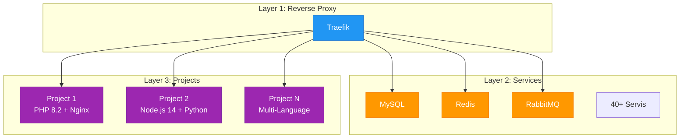

# Stackvo'a Giriş

Stackvo, modern web geliştirme süreçlerinizi hızlandıran ve kolaylaştıran Docker tabanlı bir geliştirme ortamı yönetim sistemidir. Bu sayfa, Stackvo'un ne olduğunu, hangi sorunları çözdüğünü, temel özelliklerini ve neden diğer alternatiflerden daha iyi olduğunu detaylı olarak açıklamaktadır.

---

## Stackvo Nedir?

**Stackvo**, modern web geliştirme projeleriniz için **Docker tabanlı**, tamamen **özelleştirilebilir** ve **modüler** bir geliştirme ortamı yönetim sistemidir.

!!! quote "Tek Komutla Tam Stack"
Stackvo ile 40+ servisi tek bir komutla başlatın, yönetin ve ölçeklendirin.

---

## Temel Özellikler

### Multi-Language Desteği

Stackvo 6 farklı programlama dilini destekler:

| Dil | Versiyon Desteği | Özellikler |
|-----|------------------|------------|
| **PHP** | 5.6 - 8.5 | 70+ extension, Composer, Xdebug |
| **Node.js** | 12+ | npm, yarn, PM2, TypeScript |
| **Python** | 2.7 - 3.14 | pip, virtualenv, Django, Flask |
| **Go** | 1.11+ | Modern Go toolchain |
| **Ruby** | 2.4 - 3.3 | Bundler, Rails ready |
| **Rust** | 1.56+ | Cargo package manager |

### 40+ Hazır Servis

| Kategori | Adet | Örnekler |
|----------|------|----------|
| **Veritabanı** | 8 | MySQL, PostgreSQL, MongoDB, MariaDB |
| **Cache** | 2 | Redis, Memcached |
| **Message Queue** | 4 | RabbitMQ, Kafka, NATS |
| **Arama** | 4 | Elasticsearch, Meilisearch, Solr |
| **Monitoring** | 5 | Grafana, Netdata, SonarQube |
| **Web Server** | 4 | Nginx, Apache, Caddy |
| **Diğer** | 13+ | Adminer, phpMyAdmin, phpPgAdmin |

!!! info "Tüm Servisler"
    Detaylı servis listesi için [Servisler](../references/services.md) sayfasını inceleyin.

---

## Neden Stackvo?

=== "Geleneksel Yöntem"

    **❌ Sorunlar:**

    - Her servis için ayrı kurulum
    - Versiyon çakışmaları
    - Port çakışmaları
    - Karmaşık konfigürasyon
    - Platform bağımlılığı
    - Takım içi tutarsızlıklar

=== "Stackvo ile"

    **✅ Çözümler:**

    - Tek komutla tüm stack
    - İzole ortamlar
    - Otomatik port yönetimi
    - Tek dosyada konfigürasyon (.env)
    - Platform bağımsız
    - Takım içi tutarlılık

---

## Temel Kavramlar

### Generator Sistemi

!!! info "Pure Bash Implementation"
    Stackvo'un generator sistemi tamamen **Bash** ile yazılmıştır.

`.env` dosyanızdaki ayarlara göre Docker Compose, Traefik routing ve Nginx/Apache konfigürasyonlarını otomatik oluşturur.

```bash
./cli/stackvo.sh generate              # Tüm konfigürasyonları üret
./cli/stackvo.sh generate projects     # Sadece projeleri üret
./cli/stackvo.sh generate services     # Sadece servisleri üret
```

### Üç Katmanlı Mimari



### Proje Sistemi

Her proje bir `stackvo.json` dosyası ile tanımlanır:

```json title="stackvo.json"
{
  "name": "myproject",
  "domain": "myproject.loc",
  "php": {
    "version": "8.2",
    "extensions": ["pdo", "pdo_mysql", "mbstring", "xml"]
  },
  "webserver": "nginx",
  "document_root": "public"
}
```

### Traefik Reverse Proxy

Traefik, tüm servisleri ve projeleri otomatik olarak route eder:

- ✅ Otomatik SSL sertifikaları
- ✅ HTTP → HTTPS yönlendirme
- ✅ Docker label bazlı routing
- ✅ Dashboard: `http://traefik.stackvo.loc`

---

## Stackvo vs Alternatifler

| Özellik | Stackvo | Devilbox | Lando | DDEV | Herd |
|---------|-----------|----------|-------|------|------|
| **Fiyat** | 🆓 Ücretsiz | 🆓 Ücretsiz | 🆓 Ücretsiz | 🆓 Ücretsiz | 💎 Freemium |
| **Open Source** | ✅ Evet | ✅ Evet | ✅ Evet | ✅ Evet | ❌ Hayır |
| **Multi-Language** | ✅ 6 dil | ✅ Evet | ✅ Evet | ✅ Evet | ⚠️ PHP only |
| **Servis Sayısı** | ✅ 40+ | ✅ 30+ | ⚠️ ~20 | ⚠️ ~15 | ⚠️ ~5 |
| **Web UI** | ✅ Vue.js 3 | ✅ Evet | ❌ Yok | ❌ Yok | ✅ Evet |
| **RESTful API** | ✅ 9 endpoint | ❌ Yok | ❌ Yok | ❌ Yok | ❌ Yok |
| **Reverse Proxy** | ✅ Traefik | ✅ Nginx | ✅ Traefik | ✅ Traefik | ✅ Nginx |
| **Öğrenme Eğrisi** | 🟢 Kolay | 🟡 Orta | 🟡 Orta | 🟡 Orta | 🟢 Kolay |

### 🎯 Stackvo'un Farkı

- ✅ **Tamamen ücretsiz** ve open source
- ✅ **En fazla servis desteği** (40+)
- ✅ **Modern Web UI** (Vue.js 3 + Vuetify)
- ✅ **RESTful API** ile otomasyon
- ✅ **Multi-language** desteği (6 dil)
- ✅ **Pure Bash** generator (bağımlılık yok)

!!! tip "Daha Fazla Bilgi"
    Detaylı kurulum için [Hızlı Başlangıç](quick-start.md) sayfasını inceleyin.

